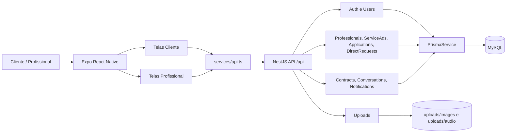

# Analise do Codigo, Componentes e Padroes

Projeto analisado: `projeto/TP4-mvp/TP4-mvp`

Base conceitual consultada:

- `Assuntos/Engenharia de Software II_Aula 05 e 06.pdf`
- `Assuntos/Engenharia de Software II_Aula 07 e 08.pdf`

Observacao importante: antes de atualizar esta analise ou o agente, verificar novamente a pasta `Assuntos`, pois os PDFs dessa pasta sao a referencia da disciplina para arquitetura baseada em componentes e padroes de projeto.

## 1. Analisar o codigo

O projeto `TP4-mvp` e um MVP chamado Conecta Obras, dividido em dois grandes componentes tecnicos:

- `backend`: API REST em NestJS, Prisma e MySQL.
- `front-end`: aplicativo Expo/React Native.

No backend, a arquitetura esta organizada por modulos NestJS em `backend/src/modules`. Cada modulo possui, em geral, controller, service e DTOs. Essa separacao segue bem a ideia de arquitetura baseada em componentes, pois cada modulo oferece funcionalidades por meio de interfaces HTTP e encapsula parte da regra de negocio.

Componentes principais do backend:

- `AuthModule`: cadastro, login, autenticacao Google, perfil e troca de senha.
- `UsersModule`: atualizacao e remocao da conta do usuario autenticado.
- `ProfessionalsModule`: perfil profissional, especialidades, disponibilidade e portfolio.
- `ServiceAdsModule`: anuncios de servico criados por clientes.
- `ApplicationsModule`: candidaturas de profissionais em anuncios.
- `DirectRequestsModule`: solicitacoes diretas feitas por clientes a profissionais.
- `ContractsModule`: contratos, historico de status, avaliacoes, respostas e reportes.
- `ConversationsModule`: conversas e mensagens de texto, audio e imagem.
- `NotificationsModule`: notificacoes e tokens de dispositivo.
- `UploadsModule`: upload local de imagens e audios.
- `CategoriesModule`: categorias de servico.
- `SupportModule`: tickets de suporte.
- `PrismaModule`: acesso ao banco de dados.

No front-end, a aplicacao usa componentes e paginas React Native. Existe uma camada `front-end/src/services/api.ts` que funciona como ponto central de comunicacao com a API. As telas ficam em `front-end/src/pages`, separadas por perfil de usuario (`cliente` e `profissional`), e alguns componentes reutilizaveis ficam em `front-end/src/components`.

Arquitetura de componentes gerada:

- Especificacao: `docs/arquitetura-componentes.architecture.json`
- HTML interativo: `docs/arquitetura-componentes.html`

Resumo textual da arquitetura:

## 2. Identificar problemas

### Problema 1: navegacao centralizada e dificil de evoluir

Localizacao:

- `front-end/src/App.tsx`, linhas 112 a 356.

O componente `App` controla tema, fluxo de login, selecao de perfil, retorno de telas, estado de servicos contratados, selecao de profissional e renderizacao de praticamente todas as telas. A decisao de qual tela renderizar usa uma cadeia grande de condicionais entre as linhas 170 e 334.

Risco:

- Alto acoplamento entre navegacao, estado global e telas.
- Dificuldade para adicionar novas telas sem modificar o componente principal.
- Dificuldade de testar fluxos isolados.

### Problema 2: regra de status de contrato espalhada

Localizacao:

- `backend/src/modules/contracts/contracts.controller.ts`, linhas 15 a 37.
- `backend/src/modules/contracts/contract-status-policy.service.ts`, linhas 10 a 59.
- `backend/src/modules/contracts/contracts.service.ts`, linhas 54 a 88 e 245 a 266.

Existe um `ContractStatusPolicyService` para validar se o usuario pode atualizar o status, mas o `ContractsService` tambem possui `assertStatusTransition`. Isso divide a regra de estado em dois lugares: uma parte no service de politica e outra no service principal.

Risco:

- Mudancas futuras no fluxo de contrato podem exigir alteracao em mais de um ponto.
- A regra de transicao fica menos clara.
- A chance de divergencia entre permissao por usuario e transicao permitida aumenta.

### Problema 3: services do backend acumulam varias responsabilidades

Localizacao:

- `backend/src/modules/applications/applications.service.ts`, linhas 108 a 194.
- `backend/src/modules/direct-requests/direct-requests.service.ts`, linhas 105 a 162.
- `backend/src/modules/contracts/contracts.service.ts`, linhas 54 a 157.

Os services nao apenas executam a regra principal, mas tambem criam contrato, historico, conversa e notificacao. Por exemplo, aceitar candidatura cria contrato, altera status de outras candidaturas, altera anuncio, cria historico, cria conversa e notifica o profissional.

Risco:

- Baixa coesao em metodos de caso de uso.
- Regras de criacao de contrato ficam duplicadas entre candidatura e solicitacao direta.
- Mudancas em notificacao ou conversa podem exigir alteracoes em fluxos de contratacao.

### Problema 4: duplicacao de includes Prisma

Localizacao:

- `backend/src/modules/contracts/contracts.service.ts`, linhas 9 a 31.
- `backend/src/modules/applications/applications.service.ts`, linhas 177 a 192.
- `backend/src/modules/direct-requests/direct-requests.service.ts`, linhas 145 a 160.

O formato completo de retorno de contrato aparece repetido em mais de um service. Isso indica que o contrato e um componente importante, mas seu formato de consulta ainda nao esta totalmente centralizado.

Risco:

- Mudancas no retorno de contrato precisam ser replicadas manualmente.
- Possibilidade de respostas inconsistentes entre endpoints.

### Problema 5: upload local acoplado ao controller

Localizacao:

- `backend/src/modules/uploads/uploads.controller.ts`, linhas 17 a 31 e 64 a 90.
- `backend/src/modules/uploads/uploads.service.ts`, linhas 5 a 31.

O armazenamento em disco, filtros e limites de arquivo estao definidos diretamente no controller. Se no futuro o projeto trocar uploads locais por S3, Cloudinary ou outro provedor, sera necessario mexer diretamente na configuracao do controller.

Risco:

- Baixa flexibilidade para trocar infraestrutura de upload.
- Regras de upload de imagem e audio ficam parcialmente duplicadas.

### Problema 6: camada de API do front-end concentra muitos contratos

Localizacao:

- `front-end/src/services/api.ts`, linhas 1 a 521.

O arquivo `api.ts` centraliza token em memoria, tipos de dominio, formatadores, request generico e todos os metodos de acesso ao backend.

Risco:

- Crescimento rapido de um unico arquivo.
- Alteracoes em um dominio podem afetar outros dominios.
- Dificuldade de reutilizar ou testar clientes especificos, como contratos, uploads ou profissionais.

### Problema 7: tokens de autenticacao apenas em memoria

Localizacao:

- `front-end/src/services/api.ts`, linhas 1 a 3 e 284 a 320.

O `accessToken` fica em variavel global de modulo. Isso funciona durante a sessao atual do app, mas tende a ser perdido em reload/reabertura do aplicativo.

Risco:

- Usuario pode perder autenticacao ao reiniciar o app.
- Dificulta estrategia futura de refresh token ou sessao persistente.

## 3. Identificar responsabilidades

### Responsabilidades por camada

- Front-end: apresentar telas, capturar entrada do usuario, validar formularios basicos, chamar API e exibir estados de carregamento/erro/sucesso.
- `services/api.ts`: adaptar chamadas HTTP do app para a API REST.
- Backend controllers: expor endpoints HTTP, receber DTOs e usuario autenticado.
- Backend services: executar regras de negocio e coordenar operacoes no banco.
- DTOs: validar formato de entrada.
- PrismaService: fornecer acesso ao banco de dados.
- Prisma schema: definir entidades, relacoes e enums persistidos.
- Uploads locais: receber arquivos e expor URLs publicas.

### Responsabilidades por componente de negocio

- Autenticacao e usuarios: criar conta, autenticar, gerar JWT, recuperar perfil, atualizar dados e remover usuario.
- Cliente: criar anuncios, acompanhar servicos, contratar profissionais e avaliar contratos.
- Profissional: cadastrar perfil, gerenciar portfolio, visualizar oportunidades, candidatar-se e responder avaliacoes.
- Marketplace: conectar anuncios, candidaturas e solicitacoes diretas.
- Contratos: representar servicos contratados, controlar status, historico, avaliacao e reabertura.
- Conversas: permitir mensagens entre cliente e profissional em contratos ou solicitacoes.
- Notificacoes: registrar eventos importantes para usuarios.
- Suporte: registrar tickets de ajuda.
- Categorias: classificar profissionais e anuncios.

## 4. Escolher o padrao adequado

Padrao principal recomendado: `State`.

Justificativa:

O problema mais claro de projeto esta no fluxo de status de contrato. O contrato possui estados definidos no enum `ContractStatus` e regras diferentes para transicoes, usuario cliente, usuario profissional e avaliacao existente. Como o comportamento depende do estado atual, o padrao `State` e o mais adequado.

Aplicacao sugerida:

- Criar um componente de politica de estado unico para contratos.
- Cada estado (`PENDING_START`, `IN_PROGRESS`, `WAITING_CLIENT_APPROVAL`, `COMPLETED`, `REOPENED`, `CANCELED`) deve concentrar suas transicoes permitidas e suas restricoes.
- O `ContractsService` deve chamar esse componente em vez de manter uma tabela propria de transicoes.
- O `ContractsController` deve continuar apenas recebendo a requisicao e delegando.

Beneficio esperado:

- Menor acoplamento.
- Regras de estado mais explicitas.
- Mais facilidade para testar transicoes.
- Mais facilidade para evoluir o fluxo de contratos sem espalhar `if/else` ou mapas de status pelo sistema.

Padroes secundarios que podem ser considerados depois:

- `Facade`: para simplificar a criacao de contratos, conversas, historicos e notificacoes em fluxos de candidatura e solicitacao direta.
- `Adapter`: para isolar upload local e permitir trocar o provedor de armazenamento.
- `Facade` ou modularizacao por dominio: para dividir `front-end/src/services/api.ts` em clientes menores, como `authApi`, `contractsApi`, `uploadsApi` e `professionalsApi`.

## Conclusao

O projeto ja possui uma boa base componentizada no backend por modulos NestJS e no front-end por paginas/componentes. O principal ponto de melhoria e reduzir concentracao de responsabilidades em arquivos e services grandes. Com base nos PDFs, nao se deve aplicar padrao por estetica: o padrao deve responder a um problema real. Neste momento, o padrao mais adequado e `State`, porque o ciclo de vida de contratos ja e uma regra central do sistema e aparece parcialmente espalhada.
